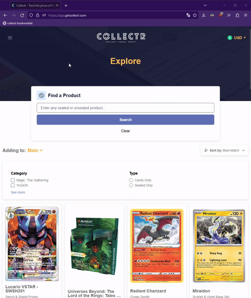

# thirdparty-tcgcollector-utilities

## Export From Collectr Bookmarklet

To use this bookmarklet, you'll first need to find your collectr collection id. To do this, open collectr in your browser, open the developer tools, open the network menu, then open your portfolio. In the network menu, you should see some requests that use a "collection_id" parameter. You'll need to replace the collectionId value in the bookmarklet with this value for it to work properly. After you modify the bookmarklet, you'll need to create a bookmark in your browser and paste the content of the bookmarklet into the location/path of the bookmark (name doesn't matter). Then in the developer tools, open the console, then click your new bookmark. The console should show an array object output that contains your collection in a way that can potentially be imported into tcg collector.

